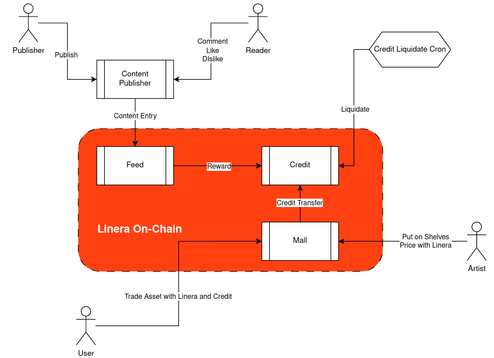

# ResPeer: Peer-to-Peer content publishing application on Linera

[](https://github.com/web3eye-io/res-peer/actions/workflows/test.yml)

## ResPeer on Linera

ResPeer is a Peer-to-Peer content publishing application on Linera. ResPeer aims to build a community in which author can publish content to get credits easily and the credits can be used to buy assets.


Basically, there're two types producer in ResPeer, one is the content producer who publishes content, they will get rewards from the reward pool of the fundation, and get credits incentive issued by credit application. Another is asset producer who create digital arts then put on shelves of the market for sale, the asset's price will be set with Linera.


A initial credit supply will be set when the application is deploy to Linera. The credits of each reaction will be exponential decay. Each credit amount earned by user reaction has its alive time, and will be destroyed (or return to current total supply) when expired. If the credit balance is lower than threshold, the total supply will be increased with 5% of the initial supply.


ResPeer provides a market for asset producers to put their work on shelves. Producer sets price of their work with Linera. The market have a unique setting which define the exchange rate of the credits and Linera token. When user buy assets, if they have credits, they can pay to the work with Linera token and credits. A fix ratio of the asset sale amount will be deposit to fundation application, which will be used to reward the content, and pay the fee for the reviewer.

## Workflow



TL;NR

## Reviewer

In ResPeer, an committee which is organized by community members will review all of the submitted content including article, comment and art work. We believe a product which does not advocate motivated values will not live long. So members in the community who proved their upright and talent will be selected as the reviewer of the committee. After they succcess to approve the content, then they will receive some rewards from the foundation.

## Foundation

Foundation is the application in which ResPeer maintain its fund. The main source of the fund will be the transaction commission of the market. For each transaction, a fix ratio of the total amount will be deposit to fundation. A fix part of the fundation's fund will be used to reward the content author, the reviewer, and the activity winner.

## Feed

ResPeer provides feed application as an on-chain CMS which will record the content directory of the feed. It also maintain the user reaction to contents. When author's content is approved by the committee, the author will receive some rewards from fundation. When user action happen, feed application will call credit application to mint credits for sender. This invocation happens on-chain.

User can like, dislike or comment to a content. It's hard to recognize if it's a spam user. So at the first stage, each sender can only like, dislike and comment to a content one time, and each sender can only react to content one time within one minute. User can also reward the content author with gift, credits or Linera token. In future we may introduce some decentralized review mechanism to avoid spam.

## Credit

ResPeer provides credits to incentive user who help to keep the network active. User can earn credits through

* Publish content to feed
* Like or dislike the content
* Comment content
  * The comment is also content, but with less weight to the network, so post a comment earn less credits compare to an origin content

Basically, credits are invaluable in the network. It's valuable only when the mall set exchange rate between the credit and the Linera token. After that when user buy asset from the mall, they can pay with Linera Token, combined with credits.

Each credits amount has its alive time. User's balance will only contain amounts which is not expired. We have two options to the expired credits: return to total supply, or burn it. But it's a bit early to decide which one we should fulfill due to we still lack of enough thoughts about the use cases.

## Market

ResPeer provides a market to producers. Beside publishing content, producer can also put their works on shelves with Linera token price. Exchange rate between credits and Linera token will be set through DAO. After that when user want to buy assets from the mall, they can pay with Linera token, combined with credits if they already earn some. A fix ratio of the total amount of each market transaction will be deposited to fundation, the used as rewards to the content author, the reviewer, and the activity winner.

## Reader Club

Reader club is another application which will hold some activities, e.g. The Most Popular Content. Reader can donation to the reader club, recommend content, sharing their view, and participate activity.

## Certificate

For some worth user, the committee can decide to issue an certificate to the user. Currently, user who donate to reader club will receive a donation certificate with badge, author who publish the most popular content will receive a golden author certificate, and each activity winner will receive a activity winner certificate.


Users can reward content they like with Linera token. They also can use the asset they bought from the market to decorate themselves in the feed application. If they got some certificate and badge successfully, it will also be displayed within the feed application.


## Compiling and Deployment
```
cargo build
linera --wallet "$LINERA_WALLET" --storage "$LINERA_STORAGE" publish-bytecode ../res-peer/target/wasm32-unknown-unknown/release/credit_{contract,service}.wasm
linera --wallet "$LINERA_WALLET" --storage "$LINERA_STORAGE" create-application e476187f6ddfeb9d588c7b45d3df334d5501d6499b3f9ad5595cae86cce16a65010000000000000001000000 --json-argument '{"initial_supply":"999999999999999.","amount_alive_ms":70}'
linera --wallet "$LINERA_WALLET" --storage "$LINERA_STORAGE" publish-bytecode ../res-peer/target/wasm32-unknown-unknown/release/feed_{contract,service}.wasm
linera --wallet "$LINERA_WALLET" --storage "$LINERA_STORAGE" create-application e476187f6ddfeb9d588c7b45d3df334d5501d6499b3f9ad5595cae86cce16a65040000000000000000000000 --json-argument '{"react_interval_ms":600000}' --json-parameters='"e476187f6ddfeb9d588c7b45d3df334d5501d6499b3f9ad5595cae86cce16a65d30000000000000000000000e476187f6ddfeb9d588c7b45d3df334d5501d6499b3f9ad5595cae86cce16a65d50000000000000000000000"' --required-application-ids e476187f6ddfeb9d588c7b45d3df334d5501d6499b3f9ad5595cae86cce16a65d30000000000000000000000e476187f6ddfeb9d588c7b45d3df334d5501d6499b3f9ad5595cae86cce16a65d50000000000000000000000
linera --wallet "$LINERA_WALLET" --storage "$LINERA_STORAGE" publish-bytecode ../res-peer/target/wasm32-unknown-unknown/release/mall_{contract,service}.wasm
linera --wallet "$LINERA_WALLET" --storage "$LINERA_STORAGE" create-application 
e476187f6ddfeb9d588c7b45d3df334d5501d6499b3f9ad5595cae86cce16a65920000000000000000000000 --json-argument '{"credits_per_linera":"30.", "max_credits_percent":13, "trade_fee_percent": 3}' --json-parameters='"e476187f6ddfeb9d588c7b45d3df334d5501d6499b3f9ad5595cae86cce16a65010000000000000001000000e476187f6ddfeb9d588c7b45d3df334d5501d6499b3f9ad5595cae86cce16a65030000000000000000000000"' --required-application-ids e476187f6ddfeb9d588c7b45d3df334d5501d6499b3f9ad5595cae86cce16a65010000000000000001000000e476187f6ddfeb9d588c7b45d3df334d5501d6499b3f9ad5595cae86cce16a65030000000000000000000000
cd webui
yarn
yarn start
```

